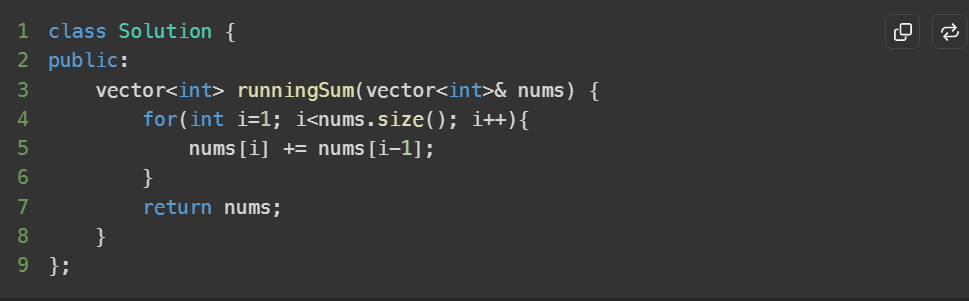
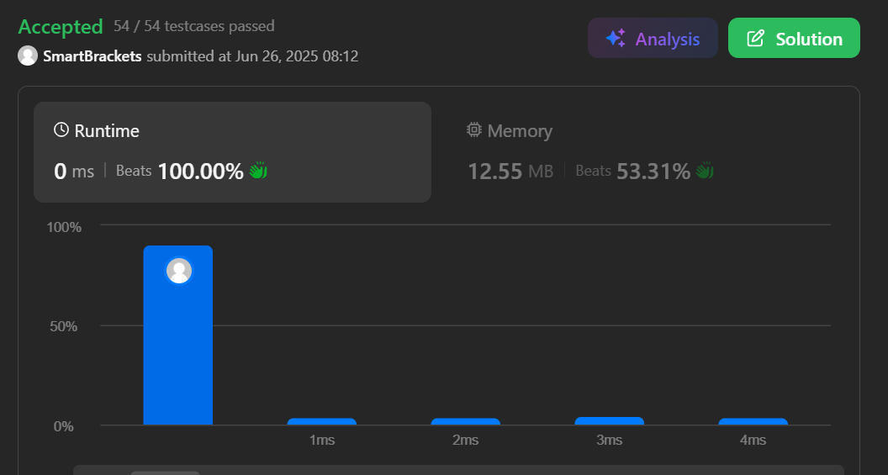

# C++ Algorithmic Complexity & STL Container 

---

## 1. Algorithmic Complexity

Understanding algorithmic complexity allows developers to analyze and predict the performance, scalability, and resource usage of code as data scales.

### 1.1 Time Complexity

**Time Complexity** represents the rate at which the execution time of an algorithm increases relative to the size of the input dataset ($N$). Rather than measuring absolute time in seconds (which varies across execution environments and hardware), time complexity quantifies the number of basic operations executed.

#### Asymptotic Notations
When evaluating time complexity, three primary theoretical notations describe performance bounds:

| Notation | Name | Description / Bound | Practical Context |
| :--- | :--- | :--- | :--- |
| $\mathcal{O}(N)$ | **Big O** | **Upper Bound** (Worst-case scenario) | Standard benchmark in technical interviews and algorithm engineering to guarantee maximum execution bounds. |
| $\Theta(N)$ | **Theta** | **Tight Bound** (Average-case / Exact order) | Reflects typical execution behavior over random input distributions. |
| $\Omega(N)$ | **Omega** | **Lower Bound** (Best-case scenario) | Minimum operations required for specific input conditions (e.g., already sorted array). |

#### Key Principles of Big O Analysis
1. **Focus on Worst-Case Scenarios:** Big O provides a safety guarantee on the maximum resource consumption regardless of input formatting.
2. **Dropping Constants:** Constant coefficients do not impact growth rates as $N 	o \infty$. Thus, $\mathcal{O}(2N)$ simplifies to $\mathcal{O}(N)$, and $\mathcal{O}(50) 	o \mathcal{O}(1)$.
3. **Dropping Non-Dominant Terms:** Higher-order terms dominate overall execution time for large inputs. For instance, $\mathcal{O}(N^2 + N + 500)$ simplifies to $\mathcal{O}(N^2)$.
4. **Additive vs. Multiplicative Rules:**
   - **Sequential Operations:** Add complexities ($\mathcal{O}(A + B)$).
   - **Nested Operations:** Multiply complexities ($\mathcal{O}(A 	imes B)$).

#### Common Time Complexity Hierarchy (Fastest to Slowest)
$$\mathcal{O}(1) < \mathcal{O}(\log N) < \mathcal{O}(N) < \mathcal{O}(N \log N) < \mathcal{O}(N^2) < \mathcal{O}(2^N) < \mathcal{O}(N!)$$

---

### 1.2 Space Complexity

**Space Complexity** quantifies the total memory space an algorithm consumes relative to the input size $N$ during execution.

#### Components of Space Complexity
$$	ext{Total Space} = 	ext{Auxiliary Space} + 	ext{Input Space}$$

* **Auxiliary Space:** Temporary space allocated by the algorithm to hold auxiliary data structures, variables, or dynamic pointers.
* **Input Space:** Memory required to store the initial input arguments passed to the function.

#### Key Considerations
* **In-Place Algorithms:** Operate with $\mathcal{O}(1)$ auxiliary space complexity by mutating input memory directly (e.g., standard `std::swap`).
* **Call Stack Space:** Recursive function invocations allocate stack frames. Deep recursion of depth $D$ contributes $\mathcal{O}(D)$ space complexity even without explicit array declarations.

---

## 2. C++ Standard Template Library (STL) Core Reference

The C++ Standard Template Library provides generic data structures, algorithms, and utilities optimized for memory footprint and execution speed.

### 2.1 Dynamic Arrays & Sequential Containers

#### `std::vector`
* **Overview:** A contiguous dynamic array structure. Unlike raw fixed-size C-style arrays (`int arr[100]`), vectors dynamically resize automatically when capacity limits are hit.
* **Internal Mechanism:** Maintains a continuous block of memory along with `size` and `capacity`. When capacity is exceeded, memory is reallocated (typically doubling existing capacity) and elements are copied/moved to the new region.
* **Time Complexities:**
  * Direct Access (`vec[i]`): $\mathcal{O}(1)$
  * Push / Pop Back (`push_back`, `pop_back`): $\mathcal{O}(1)$ amortized
  * Insertion / Deletion at Arbitrary Index (`insert`, `erase`): $\mathcal{O}(N)$ due to element shifts
* **Use Case:** Default choice for sequential collections where random access is needed and elements are primarily appended to the back.

---

### 2.2 Associative & Hash-Based Containers

#### `std::unordered_map`
* **Overview:** Key-value store implemented using an internal Hash Table with bucket chaining.
* **Key Feature:** Keys are stored in an arbitrary (unordered) arrangement.
* **Time Complexity:** Average $\mathcal{O}(1)$ for lookup, insertion, and deletion; worst-case $\mathcal{O}(N)$ when hash collisions degrade buckets to linear linked lists.
* **Use Case:** High-speed key-value lookups, counting element frequencies, and cache lookups where order is irrelevant.

#### `std::map`
* **Overview:** Key-value associative container backed by a self-balancing binary search tree (typically a Red-Black Tree).
* **Key Feature:** Automatically maintains unique keys in strictly ascending order.
* **Time Complexity:** Guaranteed logarithmic $\mathcal{O}(\log N)$ for lookup, insertion, and deletion.
* **Use Case:** Ordered key processing, range-query operations (`lower_bound`, `upper_bound`), and sorted output demands.

#### `std::unordered_set` / `std::set`
* **Overview:** Unique element collections (without paired values). `unordered_set` uses hashing; `set` uses self-balancing search trees.
* **Time Complexity:**
  * `unordered_set`: Average $\mathcal{O}(1)$ lookup/insert.
  * `set`: Guaranteed $\mathcal{O}(\log N)$ lookup/insert.
* **Use Case:** De-duplicating values, fast element membership checking, and maintaining unique elements.

#### `std::multiset`
* **Overview:** Ordered tree-based container allowing duplicate elements.
* **Time Complexity:** $\mathcal{O}(\log N)$ insertion, deletion, and element lookup.
* **Use Case:** Frequency tracking under continuous sorting (e.g., maintaining dynamic running medians or priority scoring with duplicate values).

---

### 2.3 Container Adapters

#### `std::priority_queue`
* **Overview:** Container adapter implementing a Max-Heap structure by default (the highest priority element is at the top).
* **Min-Heap Configuration:** Constructed via `std::priority_queue<int, std::vector<int>, std::greater<int>>`.
* **Time Complexity:**
  * Top Element Access (`top()`): $\mathcal{O}(1)$
  * Push / Pop (`push()`, `pop()`): $\mathcal{O}(\log N)$
* **Use Case:** Dijkstra’s Algorithm, Task Scheduling, and finding $K$-th largest/smallest elements.

---

### 2.4 C++ STL Utilities & Language Constructs

#### `std::pair`
* **Header:** `<utility>`
* **Description:** Simple heterogeneous structure holding two distinct values. Members are accessed via `.first` and `.second`.
* **Use Case:** Returning two values from a function, storing coordinate pairs `(x, y)`, or tracking `(weight, vertex)` pairs in graph adjacency lists.

#### STL Iterators
* **Description:** Generalized pointer abstractions providing uniform access to elements across sequential and associative STL containers.
* **Common Syntax:** `container.begin()` (first element) and `container.end()` (iterator pointing past the last element).
* **Operations:** Dereferencing (`*it`), advancement (`++it`), and pointer arithmetic (for random-access iterators).

#### Range-Based `for` Loops & `auto` Keyword
* **Range-based `for` loop:** Clean syntax to traverse collections cleanly: `for (const auto& item : vec)`.
* **`auto` Keyword:** Automatic type inference by the compiler at compile time, eliminating complex template type signatures (e.g., `std::vector<std::pair<int, std::string>>::const_iterator`).

---

## 3. C++ Code Implementation Reference

```cpp
#include <iostream>
#include <vector>
#include <unordered_map>
#include <map>
#include <set>
#include <queue>
#include <utility>

void demonstrateSTL() {
    // 1. std::vector
    std::vector<int> numbers = {10, 20, 30};
    numbers.push_back(40); // O(1) amortized
    
    // 2. std::pair & Iterators
    std::pair<int, std::string> user = {1, "Alice"};
    std::cout << "ID: " << user.first << ", Name: " << user.second << "
";

    // 3. Range-based for loop with auto keyword
    std::cout << "Vector contents: ";
    for (auto val : numbers) { // Fast, readable traversal
        std::cout << val << " ";
    }
    std::cout << "
";

    // 4. std::unordered_map (Hash Table)
    std::unordered_map<std::string, int> freqMap;
    freqMap["apple"] = 5;
    freqMap["banana"] = 2; // O(1) average lookup/insert

    // 5. std::map (Red-Black Tree)
    std::map<int, std::string> sortedMap;
    sortedMap[3] = "Three";
    sortedMap[1] = "One"; // O(log N) insertion, strictly ordered

    // 6. std::priority_queue (Max-Heap)
    std::priority_queue<int> maxHeap;
    maxHeap.push(10);
    maxHeap.push(50);
    maxHeap.push(20); // O(log N) push
    // top() is 50 -> O(1)
}

int main() {
    demonstrateSTL();
    return 0;
}
```

---

## 4. STL Container Quick-Reference Matrix

| Container | Internal Structure | Time Complexity (Avg) | Time Complexity (Worst) | Primary Use Case |
| :--- | :--- | :--- | :--- | :--- |
| `std::vector` | Dynamic Array | Access: $\mathcal{O}(1)$<br> Push/Pop Back: $\mathcal{O}(1)$ | Access: $\mathcal{O}(1)$<br> Push Back: $\mathcal{O}(N)$ (realloc) | Sequential data storage, fast random access. |
| `std::unordered_map` | Hash Table | Search/Insert: $\mathcal{O}(1)$ | Search/Insert: $\mathcal{O}(N)$ | Fast key-value lookups without order guarantees. |
| `std::map` | Red-Black Tree | Search/Insert: $\mathcal{O}(\log N)$ | Search/Insert: $\mathcal{O}(\log N)$ | Sorted key-value pairs and range queries. |
| `std::unordered_set` | Hash Table | Search/Insert: $\mathcal{O}(1)$ | Search/Insert: $\mathcal{O}(N)$ | Unordered duplicate elimination and lookup. |
| `std::set` | Red-Black Tree | Search/Insert: $\mathcal{O}(\log N)$ | Search/Insert: $\mathcal{O}(\log N)$ | Maintaining ordered unique elements. |
| `std::multiset` | Red-Black Tree | Search/Insert: $\mathcal{O}(\log N)$ | Search/Insert: $\mathcal{O}(\log N)$ | Storing sorted elements with allowed duplicates. |
| `std::priority_queue` | Binary Heap | Push/Pop: $\mathcal{O}(\log N)$<br> Top: $\mathcal{O}(1)$ | Push/Pop: $\mathcal{O}(\log N)$<br> Top: $\mathcal{O}(1)$ | Priority scheduling, min/max element extraction. |

## Accepted Leetcode Submission

